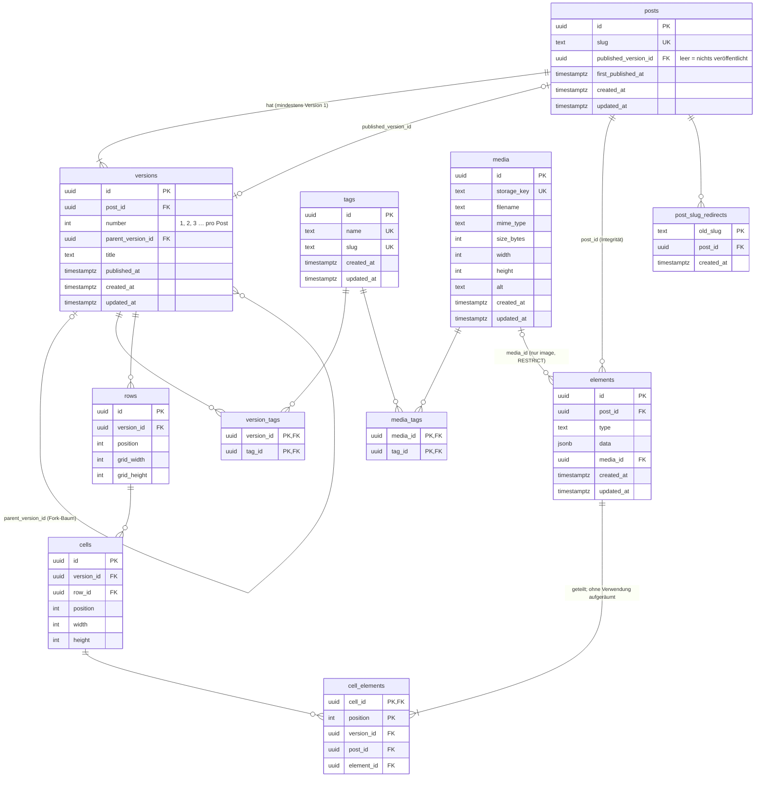

# rootyourself – Konzept

Blog mit öffentlichem Frontend und passwortgeschütztem Admin-Bereich in einer
Next.js-App. Es gibt genau eine Person, die Posts schreibt.

## Stack

| Bereich            | Wahl                                                                  |
| ------------------ | --------------------------------------------------------------------- |
| App                | Next.js (App Router), React, TypeScript, Tailwind                     |
| Hosting            | Vercel (kein lokales Dateisystem – nichts wird lokal abgelegt)        |
| Datenbank          | Neon Postgres 18 (Free-Plan), via Vercel Marketplace                  |
| Datenbank-Zugriff  | Drizzle ORM; Neon-WebSocket-Treiber (Produktion), `pg` (lokal)        |
| Bilder             | Cloudflare R2 (Produktion), RustFS (lokal, S3-kompatibel); Upload per Presigned URL direkt aus dem Browser |
| Backend-Schnittstelle | REST-API über Route Handlers (`src/app/api/…`)                     |
| Zugangsschutz      | HTTP Basic Auth (htpasswd-kompatibler Hash) in `proxy.ts`             |
| Tests              | Vitest gegen eine Testdatenbank im lokalen Postgres-Container         |
| Suche              | Später: Algolia, befüllt beim Veröffentlichen                         |
| Lokale Entwicklung | Docker (`docker/docker-compose.dev.yml`): App auf Port 3002, Postgres 18 auf Port 5433, RustFS auf Port 9000 (Weboberfläche 9001) |

## Lokale Entwicklung

- `npm run docker:dev` startet App und Postgres-Container (gleiche Version wie Neon, Postgres 18).
  Die Daten liegen im Docker-Volume `rootyourself_pgdata`.
- `src/db/index.ts` wählt den Treiber anhand von `DATABASE_URL`: Neon-Host → Neon-WebSocket-Treiber,
  sonst `pg` (node-postgres).
- `.env.local` zeigt auf `localhost:5433`, damit `drizzle-kit` (`npm run db:migrate`, `npm run db:studio`)
  vom Host aus funktioniert. Im Web-Container überschreibt die Compose-Datei den Wert mit `db:5432`.
- Die Produktions-Datenbank steht bewusst nicht in `.env.local`. Migrationen für Neon:
  `vercel env pull` in eine separate Datei und `DATABASE_URL` gezielt setzen.
- RustFS ersetzt lokal Cloudflare R2 (MinIO wird nicht mehr als Image veröffentlicht). Der Code
  spricht nur die S3-API; umgeschaltet wird über die `S3_…`-Variablen. `storage-setup` legt beim
  Start den Bucket an und setzt öffentliches Lesen und CORS (`scripts/setup-storage.mjs`).
- Neue npm-Pakete brauchen einen Neubau des Web-Containers (`npm run docker:dev:build`), weil
  dessen `node_modules` in einem eigenen Volume liegen.

## Entitäten

- **Post**: Klammer um einen Slug. Hat einen Baum von Versionen, von denen
  höchstens eine veröffentlicht ist.
- **Version**: ein vollständiger Stand eines Posts – Titel, Tags und das
  Layout aus Rows, Zellen und Elementen. Entsteht beim Anlegen des Posts
  (Version 1) oder durch Forken einer bestehenden Version.
- **Row**: horizontaler Abschnitt im Main-Bereich; Rows stehen untereinander.
  Jede Row hat ein Grid (`grid_width` × `grid_height`). Später: Hintergrund.
- **Zelle**: Bereich im Grid einer Row mit `width` × `height` Grid-Feldern.
  Später: Hintergrund.
- **Element**: Inhaltsbaustein in einer Zelle; Elemente einer Zelle stehen
  untereinander. Typen: `heading`, `text` (Markdown), `image` (verweist auf
  die Mediathek); weitere folgen. Mehrere Versionen desselben Posts können
  dasselbe Element verwenden (Copy-on-Write).
- **Tag**: Name und Slug. Gemeinsam für Posts und Medien: an Posts als
  Metadaten pro Version, an Medien zum Ordnen der Mediathek (nicht versioniert).
- **Medium**: Bild in R2, verwaltet über die Mediathek.

## Seitenlayout

```
Header   – für alle Seiten gleich, im Code (vorerst ohne Navigation)
Main     – enthält alle Elemente eines Posts
 ├─ Row 1   Grid 3×2               ┌───────┬───┐
 │   ├─ Zelle A (2×2): E1, E2      │  A    │ B │
 │   ├─ Zelle B (1×1): E3          │       ├───┤
 │   └─ Zelle C (1×1): E4          │       │ C │
 │                                 └───────┴───┘
 └─ Row 2 …
Footer   – für alle Seiten gleich, im Code
```

- Zellen werden automatisch platziert: in der Reihenfolge `position` von
  links oben nach rechts unten (CSS-Grid-Auto-Placement). Keine festen
  Koordinaten, dadurch keine Überlappungen. Feste Koordinaten (`x`, `y`)
  lassen sich später ergänzen.
- Auf schmalen Bildschirmen stehen die Zellen einer Row untereinander, in
  derselben Reihenfolge.
- Alle Zellen müssen in das Grid passen: `width ≤ grid_width`,
  `height ≤ grid_height`, und nach der automatischen Platzierung darf keine
  Zelle unterhalb der letzten Grid-Zeile landen. Das Backend prüft das beim
  Speichern (`saveVersionInput`). Im Editor wächst das Grid automatisch um die
  nötigen Zeilen, wenn Zellen breiter oder höher werden, hinzukommen oder
  umsortiert werden.
- Leere Rows und leere Zellen sind erlaubt.
- Lesereihenfolge (Anreißer, Teaser-Bild, später Suche):
  Row → Zelle → Element, jeweils nach `position`.

## Versionierung

### Begriffe

- **Fork-Baum**: Jede Version außer Version 1 hat eine Elternversion
  (`parent_version_id`), von der sie geforkt wurde.
- **Blatt**: Version ohne Kinder.
- **Eingefroren**: nicht veränderbar. Eingefroren sind alle inneren Knoten
  (Versionen mit Kindern) und die veröffentlichte Version.
- **Bearbeitbar** sind also genau die unveröffentlichten Blätter.

### Regeln

| Aktion | Verhalten |
| --- | --- |
| Post anlegen | In einer Transaktion: Post und Version 1 (ohne Elemente, ohne Tags). |
| Version forken | Von jeder Version möglich (auch eingefroren). Neue Version mit nächster `number`, `parent_version_id` = Quelle, gleicher Titel. Kopiert werden `rows`, `cells`, `cell_elements` und `version_tags` (kleine Strukturdaten, neue IDs) – keine Elementinhalte. |
| Unveröffentlichtes Blatt speichern | Direkt in dieser Version, mit Überschreib-Schutz über `versions.updated_at`. |
| Veröffentlichtes Blatt speichern | Die veröffentlichte Version bleibt unverändert. Es entsteht automatisch ein unveröffentlichter Fork, in dem die Änderungen gespeichert werden. Die Antwort enthält die neue Versions-ID; der Editor wechselt dorthin. |
| Eingefrorenen inneren Knoten speichern | Abgelehnt (`409 version_frozen`). Zum Weiterarbeiten aktiv forken. |
| Element ändern | Nutzt nur diese eine Version das Element, wird es direkt geändert. Nutzen es mehrere Versionen, entsteht ein Klon mit neuer ID, auf den nur diese Version umgehängt wird. |
| Element hinzufügen | Neues Element. |
| Element entfernen / umsortieren / in eine andere Zelle verschieben | Nur `cell_elements` ändert sich; keine neuen Element-IDs. |
| Layout ändern (Rows, Grid, Zellen) | Nur `rows` und `cells` dieser Version; Elemente werden nicht geklont. |
| Tags ändern | Nur `version_tags` dieser Version. Kein Teilen, kein Copy-on-Write. |
| Aufräumen | Elemente, die keine Version mehr nutzt, werden in derselben Transaktion gelöscht. |
| Version veröffentlichen | Jede Version (auch ein innerer Knoten = Rollback). `posts.published_version_id` zeigt auf sie, `versions.published_at = now()`, beim ersten Mal auch `posts.first_published_at = now()`. Ändert `posts.updated_at` (der Slug-Überschreib-Schutz sieht die Veröffentlichung). |
| Veröffentlichung zurückziehen | `posts.published_version_id = NULL`. |
| Version löschen | Nur unveröffentlichte Blätter, und nicht die letzte verbleibende Version eines Posts (`409 version_published` / `version_has_children` / `last_version`). |

- Innerhalb einer Version kommt jedes Element höchstens einmal vor.
- Jede Änderung an Versionen (Speichern, Forken, Veröffentlichen, Löschen)
  sperrt den Post (`SELECT … FOR UPDATE`). Änderungen an einem Post laufen
  dadurch nacheinander: „ist ein Blatt“ kann zwischen Prüfung und Schreiben
  nicht durch ein paralleles Forken ungültig werden, und die nächste
  Versionsnummer ist eindeutig.
- Wird der einzige Fork einer Version gelöscht, ist sie wieder ein Blatt und
  damit – sofern nicht veröffentlicht – wieder bearbeitbar.

### Speichern eines Blatts im Detail

Der Editor schickt den vollständigen Stand der Version:

```json
{
  "title": "…",
  "tagIds": ["…"],
  "rows": [
    {
      "gridWidth": 3, "gridHeight": 2,
      "cells": [
        {
          "width": 2, "height": 2,
          "elements": [
            { "id": "…", "type": "text", "data": { "markdown": "…" } },
            { "type": "image", "data": { "caption": "…" }, "mediaId": "…" }
          ]
        }
      ]
    }
  ],
  "updatedAt": "…"
}
```

Die Reihenfolge der Arrays ergibt die `position` von Rows, Zellen und
Elementen.

In einer Transaktion:

1. Version sperren; prüfen: Blatt, nicht veröffentlicht (sonst Auto-Fork),
   `updatedAt` passt (sonst `409 version_conflict`).
2. Titel übernehmen, `version_tags` ersetzen.
3. Für jedes Element:
   - ohne `id` → neues Element anlegen;
   - mit `id` → muss bereits in dieser Version verlinkt sein (sonst `400`);
     unverändert → behalten; verändert → direkt ändern, wenn nur diese
     Version es nutzt, sonst klonen.
4. `rows`, `cells` und `cell_elements` der Version neu schreiben (Rows und
   Zellen sind Strukturdaten ohne Inhalt; Neuschreiben ist einfacher als ein
   Abgleich).
5. Verwaiste Elemente des Posts löschen, `versions.updated_at = now()`.

- Ungültige Eingaben (fremde Element-IDs) werden geprüft, bevor ein Auto-Fork
  entsteht – es bleibt also kein leerer Fork übrig. Unbekannte Tags oder
  Bilder brechen die ganze Transaktion ab.
- Grenzen: Grid und Zellen höchstens 12 × 12, `width ≤ grid_width` und
  `height ≤ grid_height` (Prüfung in `saveVersionInput`), höchstens 100
  Elemente pro Zelle, Markdown höchstens 50 000 Zeichen pro Text-Element.
- „Unverändert“ vergleicht Typ, Medium und `data` inhaltlich (unabhängig von
  der Reihenfolge der JSON-Schlüssel).

## Datenbankschema

### Diagramm



Lesehilfe: `||` genau eins, `|o` null oder eins, `|{` eins oder mehrere,
`o{` null oder mehrere.

- **Pro Version kopiert** beim Forken: `rows`, `cells`, `cell_elements`,
  `version_tags`.
- **Zwischen Versionen geteilt** (Copy-on-Write): `elements`.
- **Global**: `tags`, `media`, `media_tags`.

### SQL

```sql
CREATE TABLE tags (
  id          uuid PRIMARY KEY DEFAULT gen_random_uuid(),
  name        text NOT NULL UNIQUE,
  slug        text NOT NULL UNIQUE,
  created_at  timestamptz NOT NULL DEFAULT now(),
  updated_at  timestamptz NOT NULL DEFAULT now()
);

CREATE TABLE media (
  id          uuid PRIMARY KEY DEFAULT gen_random_uuid(),
  storage_key text NOT NULL UNIQUE,
  filename    text NOT NULL,
  mime_type   text NOT NULL,
  size_bytes  integer NOT NULL,
  width       integer NOT NULL,
  height      integer NOT NULL,
  alt         text NOT NULL DEFAULT '',
  created_at  timestamptz NOT NULL DEFAULT now(),
  updated_at  timestamptz NOT NULL DEFAULT now()
);

-- Tags an Medien (nicht versioniert).
CREATE TABLE media_tags (
  media_id  uuid NOT NULL REFERENCES media (id) ON DELETE CASCADE,
  tag_id    uuid NOT NULL REFERENCES tags (id)  ON DELETE CASCADE,
  PRIMARY KEY (media_id, tag_id)
);
CREATE INDEX media_tags_tag_idx ON media_tags (tag_id);

CREATE TABLE posts (
  id                    uuid PRIMARY KEY DEFAULT gen_random_uuid(),
  slug                  text NOT NULL UNIQUE,
  published_version_id  uuid,
  first_published_at    timestamptz,
  created_at            timestamptz NOT NULL DEFAULT now(),
  updated_at            timestamptz NOT NULL DEFAULT now(),
  CHECK (published_version_id IS NULL OR first_published_at IS NOT NULL),
  -- Die veröffentlichte Version muss zu diesem Post gehören.
  FOREIGN KEY (id, published_version_id) REFERENCES versions (post_id, id)
);
CREATE INDEX posts_feed_idx ON posts (first_published_at DESC, id DESC)
  WHERE published_version_id IS NOT NULL;

CREATE TABLE versions (
  id                 uuid PRIMARY KEY DEFAULT gen_random_uuid(),
  post_id            uuid NOT NULL REFERENCES posts (id) ON DELETE CASCADE,
  number             integer NOT NULL,          -- 1, 2, 3 … pro Post
  parent_version_id  uuid,
  title              text NOT NULL,
  published_at       timestamptz,               -- letzte Veröffentlichung dieser Version
  created_at         timestamptz NOT NULL DEFAULT now(),
  updated_at         timestamptz NOT NULL DEFAULT now(),
  UNIQUE (post_id, number),
  UNIQUE (post_id, id),
  CHECK (parent_version_id <> id),
  -- Die Elternversion muss zum selben Post gehören.
  FOREIGN KEY (post_id, parent_version_id) REFERENCES versions (post_id, id)
);
CREATE INDEX versions_parent_idx ON versions (parent_version_id);

CREATE TABLE version_tags (
  version_id  uuid NOT NULL REFERENCES versions (id) ON DELETE CASCADE,
  tag_id      uuid NOT NULL REFERENCES tags (id)     ON DELETE CASCADE,
  PRIMARY KEY (version_id, tag_id)
);
CREATE INDEX version_tags_tag_idx ON version_tags (tag_id);

CREATE TABLE elements (
  id          uuid PRIMARY KEY DEFAULT gen_random_uuid(),
  post_id     uuid NOT NULL REFERENCES posts (id) ON DELETE CASCADE,
  type        text NOT NULL,
  data        jsonb NOT NULL DEFAULT '{}',
  media_id    uuid REFERENCES media (id) ON DELETE RESTRICT,
  created_at  timestamptz NOT NULL DEFAULT now(),
  updated_at  timestamptz NOT NULL DEFAULT now(),
  UNIQUE (post_id, id),
  CHECK ((type = 'image') = (media_id IS NOT NULL))
);
CREATE INDEX elements_media_idx ON elements (media_id);

CREATE TABLE rows (
  id           uuid PRIMARY KEY DEFAULT gen_random_uuid(),
  version_id   uuid NOT NULL REFERENCES versions (id) ON DELETE CASCADE,
  position     integer NOT NULL,
  grid_width   integer NOT NULL CHECK (grid_width > 0),
  grid_height  integer NOT NULL CHECK (grid_height > 0),
  -- später: Hintergrund
  UNIQUE (version_id, position),
  UNIQUE (version_id, id)
);

CREATE TABLE cells (
  id          uuid PRIMARY KEY DEFAULT gen_random_uuid(),
  version_id  uuid NOT NULL,
  row_id      uuid NOT NULL,
  position    integer NOT NULL,
  width       integer NOT NULL CHECK (width > 0),
  height      integer NOT NULL CHECK (height > 0),
  -- später: Hintergrund
  UNIQUE (row_id, position),
  UNIQUE (version_id, id),
  -- Die Zelle gehört zu einer Row derselben Version.
  FOREIGN KEY (version_id, row_id) REFERENCES rows (version_id, id) ON DELETE CASCADE
);

CREATE TABLE cell_elements (
  cell_id     uuid NOT NULL,
  version_id  uuid NOT NULL,
  post_id     uuid NOT NULL,
  position    integer NOT NULL,
  element_id  uuid NOT NULL,
  PRIMARY KEY (cell_id, position),
  -- Jedes Element höchstens einmal pro Version.
  UNIQUE (version_id, element_id),
  -- Zelle, Version und Element gehören zusammen.
  FOREIGN KEY (version_id, cell_id) REFERENCES cells (version_id, id) ON DELETE CASCADE,
  FOREIGN KEY (post_id, version_id) REFERENCES versions (post_id, id) ON DELETE CASCADE,
  FOREIGN KEY (post_id, element_id) REFERENCES elements (post_id, id)
);
CREATE INDEX cell_elements_element_idx ON cell_elements (element_id);

CREATE TABLE post_slug_redirects (
  old_slug    text PRIMARY KEY,
  post_id     uuid NOT NULL REFERENCES posts (id) ON DELETE CASCADE,
  created_at  timestamptz NOT NULL DEFAULT now()
);
```

Anmerkungen:

- `posts` und `versions` verweisen gegenseitig aufeinander; in der Migration
  wird der FK `posts → versions` nach beiden Tabellen per `ALTER TABLE`
  ergänzt.
- FKs ohne `ON DELETE` sind `NO ACTION`. Achtung: Postgres prüft sie am Ende
  jeder einzelnen Kaskade, nicht der ganzen Anweisung. Beim Löschen eines Posts
  entfernt eine Kaskade die Elemente, eine andere (über die Versionen) erst
  danach deren Verknüpfungen. Deshalb ist `cell_elements → elements`
  `DEFERRABLE INITIALLY DEFERRED` und wird erst beim Commit geprüft (eigene
  Migration `drizzle/0001_…`, weil Drizzle das im Schema nicht ausdrücken
  kann). Ein noch verwendetes Element bleibt trotzdem unlöschbar.
- Tabellennamen stehen immer im Plural.
- Zeitstempel haben Millisekunden-Genauigkeit (`timestamp(3)`), passend zu
  JavaScript-Dates – sonst würde der Überschreib-Schutz über `updatedAt` nie
  greifen. Änderungen setzen `updated_at = clock_timestamp()`, weil `now()`
  innerhalb einer Transaktion konstant ist.
- Die Platzierung eines Elements steht in `cell_elements`, nicht im Element:
  Elemente sind zwischen Versionen geteilt, Rows und Zellen nicht. Ein
  `cell_id` am Element würde jeden Fork zum Klonen aller Elemente zwingen.
- `elements.post_id`, `cells.version_id` sowie `cell_elements.version_id` und
  `cell_elements.post_id` sind kein fachlicher Besitz, sondern sichern über
  zusammengesetzte FKs ab, dass nichts über Versions- oder Postgrenzen hinweg
  verknüpft wird.
- „Wie viele Versionen nutzen dieses Element?“ beantwortet
  `cell_elements_element_idx`.

### `elements.data` je Typ

| `type`    | `data`                             | `media_id` |
| --------- | ---------------------------------- | ---------- |
| `heading` | `{ "level": 2 \| 3, "text": "…" }` | –          |
| `text`    | `{ "markdown": "…" }`              | –          |
| `image`   | `{ "caption": "…" }` (optional)    | Pflicht    |

`data` wird in der App mit Zod validiert. Ein neuer Elementtyp braucht nur
dann eine Migration, wenn er auf eine andere Tabelle verweist – dann bekommt
er eine eigene, optionale FK-Spalte nach dem Muster von `media_id`.

### Weitere Regeln

| Aktion | Verhalten |
| --- | --- |
| Post löschen | Versionen, Verknüpfungen, Elemente, Tag-Zuordnungen und Weiterleitungen werden mitgelöscht. |
| Tag löschen | Nur manuell im Admin; wird aus allen Versionen (auch eingefrorenen) und allen Medien entfernt (CASCADE). |
| Medium löschen | Blockiert, solange irgendein Element es verwendet – auch in eingefrorenen Versionen. |
| Slug ändern (gilt für alle Versionen) | War der Post schon einmal veröffentlicht, Eintrag in `post_slug_redirects`, dauerhafte Weiterleitung (308) auf den aktuellen Slug, keine Ketten. Überschreib-Schutz über `posts.updated_at`. |
| Neuer Slug entspricht einem alten Slug | Der Weiterleitungseintrag wird in derselben Transaktion gelöscht. |

- Bild-URLs werden nicht gespeichert, sondern aus `storage_key` und
  `MEDIA_PUBLIC_URL` zusammengesetzt.

## REST-API

Alle Antworten sind JSON. Fehler haben immer die Form
`{ "error": { "code": "…", "message": "…", "field": "…" } }`.

| Status | Wann |
| --- | --- |
| `200` / `201` / `204` | Erfolg / angelegt / gelöscht |
| `400` | Eingabe ungültig (Zod-Fehler pro Feld) |
| `401` | Nicht angemeldet (`proxy.ts`) |
| `404` | Nicht gefunden |
| `409` | Konflikt: Slug vergeben, Medium in Verwendung, Version eingefroren, zwischenzeitlich geändert |

### Admin (`/api/admin/…`, Basic Auth über `proxy.ts`)

| Methode | Pfad | Zweck |
| --- | --- | --- |
| `GET` | `/tags` | Liste, deutsch sortiert, mit `postCount` (Posts, in denen irgendeine Version den Tag nutzt), `publishedPostCount` (Posts, deren veröffentlichte Version ihn nutzt) und `mediaCount` |
| `POST` | `/tags` | Anlegen `{ name }`, Slug wird erzeugt |
| `PATCH` | `/tags/:id` | Umbenennen `{ name?, slug?, updatedAt }`; der Slug bleibt beim Umbenennen erhalten und ändert sich nur ausdrücklich |
| `DELETE` | `/tags/:id` | Löschen |
| `POST` | `/media/uploads` | Upload vorbereiten `{ filename, mimeType, size }` → `{ uploadUrl, key }` |
| `POST` | `/media` | Upload bestätigen `{ key, filename, width, height, alt }` |
| `GET` | `/media` | Mediathek mit Tags und Nutzung, neueste zuerst; Filter `?tag=<id>` |
| `PATCH` | `/media/:id` | Alt-Text und/oder Tags ändern `{ alt?, tagIds?, updatedAt }`; `tagIds` ersetzt alle Tags |
| `DELETE` | `/media/:id` | Löschen (`409`, wenn verwendet) |
| `GET` | `/posts` | Alle Posts, zuletzt geänderte zuerst: Titel (der veröffentlichten, sonst der zuletzt geänderten Version), veröffentlichte Version, Anzahl Versionen und bearbeitbarer Versionen |
| `POST` | `/posts` | Post mit Version 1 anlegen `{ title, slug? }`; ohne Slug aus dem Titel erzeugt. Übernimmt der Slug eine alte Weiterleitung, entfällt diese |
| `GET` | `/posts/:id` | Post mit Versionen (ID, Nummer, Eltern, Titel, veröffentlicht, Blatt, bearbeitbar, `updatedAt`) und früheren Slugs |
| `PATCH` | `/posts/:id` | Slug ändern `{ slug, updatedAt }` |
| `DELETE` | `/posts/:id` | Post löschen |
| `POST` | `/posts/:id/unpublish` | Veröffentlichung zurückziehen; liefert den Post |
| `GET` | `/posts/:id/versions/:vid` | Version vollständig: Titel, Tags, Rows → Zellen → Elemente (Bild-Elemente mit URL, Maßen und Alt-Text des Mediums) |
| `PUT` | `/posts/:id/versions/:vid` | Version speichern; liefert `{ version, forkedFrom }`. Bei der veröffentlichten Version ist `version` der neue Fork und `forkedFrom` die ursprüngliche ID. Fehler: `version_conflict`, `version_frozen`, `element_unknown`, `tag_unknown`, `media_unknown` |
| `DELETE` | `/posts/:id/versions/:vid` | Unveröffentlichtes Blatt löschen |
| `POST` | `/posts/:id/versions/:vid/fork` | Aktiv forken; liefert die neue Version (`201`) |
| `POST` | `/posts/:id/versions/:vid/publish` | Diese Version veröffentlichen (auch Rollback); liefert den Post |

### Öffentlich (ohne Anmeldung, gecacht)

| Methode | Pfad | Zweck |
| --- | --- | --- |
| `GET` | `/api/posts?after=<cursor>` | Nächste zehn Teaser für die Startseite |
| `GET` | `/api/tags/:slug/posts?after=<cursor>` | Nächste zehn Teaser einer Tag-Seite |

Die öffentlichen Seiten rendern auf dem Server und rufen die
Service-Funktionen direkt auf, nicht über die eigene API. Die öffentliche API
dient nur dem Nachladen im Browser.

## Dateistruktur

```
src/
├─ app/
│  ├─ api/
│  │  ├─ admin/…                     ← Route Handlers der Admin-API
│  │  ├─ posts/route.ts              ← öffentlich
│  │  └─ tags/[slug]/posts/route.ts  ← öffentlich
│  ├─ admin/…                        ← Admin-Seiten
│  ├─ posts/[slug]/page.tsx
│  ├─ tags/[slug]/page.tsx
│  └─ page.tsx
├─ server/                           ← Service-Funktionen, kennen Next.js nicht
│  ├─ tags/   ├─ media/   ├─ posts/   ├─ versions/
│  └─ http.ts                        ← Ergebnis/Fehler → HTTP-Antwort
├─ shared/api/                       ← Zod-Schemas und Typen für Anfragen und Antworten
├─ db/                               ← Schema, Elementtypen, Client
├─ lib/                              ← Auth, Slugs
└─ proxy.ts
```

- Route Handlers sind dünn: Eingabe mit Zod prüfen → Service-Funktion → Cache
  invalidieren → Antwort.
- Service-Funktionen geben erwartbare Fehler als Ergebnis zurück, statt zu
  werfen.
- `src/shared/` importiert nichts Serverseitiges.

## Öffentliches Frontend

- `/` – Teaser aller veröffentlichten Posts, zuerst veröffentlichte oben
  (sortiert nach `first_published_at`).
  - Teaser aus der veröffentlichten Version: Titel, Datum, Tags, erstes
    Bild-Element (verkleinert), Anreißer aus dem ersten Text-Element (Markdown
    entfernt, ca. 300 Zeichen an einer Wortgrenze gekürzt). „Erstes“ gemäß
    Lesereihenfolge Row → Zelle → Element.
  - Zehn Posts pro Ladung, Keyset-Pagination über `(first_published_at, id)`.
  - Nachladen per IntersectionObserver; Fallback-Link `/?after=<cursor>`
    funktioniert auch ohne JavaScript.
- `/posts/[slug]` – veröffentlichte Version; bei unbekanntem Slug Suche in
  `post_slug_redirects`.
- `/tags/[slug]` – Posts, deren veröffentlichte Version den Tag hat.
- Datum: „Veröffentlicht am“ = `posts.first_published_at`; zusätzlich
  „Aktualisiert am“ = `published_at` der veröffentlichten Version, wenn später.

## Mediathek

1. `POST /api/admin/media/uploads` prüft Typ und Größe und vergibt den
   Schlüssel `JJJJ/MM/<uuid>.<endung>`. Die Presigned URL (10 Minuten gültig)
   unterschreibt `content-type` und `content-length` mit – ein PUT mit anderem
   Typ oder anderer Größe wird vom Speicher abgelehnt.
2. Der Browser lädt die Datei direkt in den Speicher (nicht durch die App:
   Vercel begrenzt Request-Bodies auf 4,5 MB).
3. `POST /api/admin/media` prüft den Schlüssel gegen das Muster, liest Größe
   und Typ per `HEAD` aus dem Speicher (nicht aus der Anfrage) und legt erst
   dann den Eintrag an. Ungültige Dateien werden gelöscht.

- Erlaubt: JPEG, PNG, WebP, AVIF, GIF, bis 20 MB. SVG nicht (kann Skripte
  enthalten).
- Löschen: erst der Datenbankeintrag, dann die Datei. Scheitert das Löschen
  der Datei, bleibt höchstens eine verwaiste Datei, nie ein Eintrag ohne Datei.
- Hochgeladene, aber nie bestätigte Dateien bleiben im Bucket liegen. Bei R2
  räumt eine Lifecycle-Regel das später auf (offen).

### Einrichtung von Cloudflare R2 (Produktion)

- Bucket anlegen, eigene Domain am Bucket aktivieren (die `r2.dev`-Adresse ist
  nicht für Produktion gedacht) → `MEDIA_PUBLIC_URL`.
- API-Token mit Schreibrecht auf den Bucket → `S3_ACCESS_KEY_ID`,
  `S3_SECRET_ACCESS_KEY`.
- `S3_ENDPOINT=https://<account-id>.r2.cloudflarestorage.com`,
  `S3_REGION=auto`, `S3_BUCKET=…`.
- CORS für die Blog-Domain setzen: `scripts/setup-storage.mjs` mit
  `S3_SKIP_POLICY=true` (R2 kennt keine Bucket-Policies) und
  `MEDIA_CORS_ORIGINS=https://…`.

## Admin-Bereich (`/admin`, Basic Auth)

- Posts: anlegen, Versionsbaum anzeigen, Version bearbeiten (Rows und Zellen
  anlegen und anordnen, Grid und Zellgrößen festlegen; Elemente hinzufügen,
  sortieren, zwischen Zellen verschieben, bearbeiten; Tags; Titel), forken, veröffentlichen,
  zurückziehen, Version löschen, Slug ändern, Vorschau. Eingefrorene Versionen
  nur lesend.
- Tags: anlegen, umbenennen, löschen (mit Anzeige der Nutzung in Posts und Medien).
- Mediathek: Upload (Presigned URL → R2, Breite/Höhe im Browser ermittelt),
  Alt-Text bearbeiten, Tags zuordnen, nach Tag filtern, löschen (nur nicht
  verwendete Bilder).
- Versions-Editor unter `/admin/posts/[id]/versions/[vid]`:
  - Titel, Tags, Rows („+ Row“ legt 1 Spalte mit einer Zelle an; Grid-Größe
    änderbar; freie Felder des Grids werden angezeigt), Zellen (Größe, Reihenfolge), Elemente (hinzufügen,
    bearbeiten, sortieren, in andere Zellen verschieben; Bilder aus der
    Mediathek).
  - Vorschau mit derselben Komponente wie die öffentliche Seite
    (`src/components/post-content.tsx`; Grid-Regeln in `globals.css`).
    Markdown über react-markdown – rohes HTML wird nicht gerendert.
  - Veröffentlichte Version: bearbeitbar, „Als neue Version speichern“ →
    Auto-Fork, der Editor wechselt zur neuen Version. Eingefrorene Versionen:
    nur lesend, „Forken und bearbeiten“.
  - Anzeige ungespeicherter Änderungen, Warnung beim Verlassen, Änderungen
    verwerfen; bei `version_conflict` Neu laden anbieten.
  - Der Arbeitsstand ist ein reines Datenmodell mit Funktionen
    (`src/app/admin/editor/draft.ts`, getestet).
  - Für die Anzeige freier Felder rechnet der Editor die Auto-Platzierung des
    Browsers nach (`src/shared/grid-placement.ts`; gegen Chromium an 300
    zufälligen Layouts ohne Abweichung geprüft). Die öffentliche Seite
    überlässt die Platzierung weiterhin dem Browser.
  - Zellen können jede Breite bis zur Spaltenzahl und jede Höhe bis zur
    Zeilenzahl bekommen; das Grid wächst dabei um die nötigen Zeilen (auch bei
    „+ Zelle“ und Umsortieren), höchstens bis 12. „Spalten“ bietet keine Werte
    unter der breitesten Zelle an, „Zeilen“ keine unter dem, was die Zellen
    brauchen – Zellen werden also nie stillschweigend verkleinert.
- Die Admin-Oberfläche entsteht Schritt für Schritt zusammen mit dem jeweiligen
  Backend-Teil.

## Caching

- Datenbankabfragen: `'use cache: remote'` mit Tags (`posts`, `post:<id>`,
  `tag:<id>`, `media:<id>`). Vercel Runtime Cache, bleibt über Deployments
  erhalten.
- Seiten: ISR-Cache auf Vercel (pro Deployment, bis 31 Tage).
- Jede Schreibaktion im Admin invalidiert gezielt die betroffenen Tags.
  Änderungen an unveröffentlichten Versionen betreffen den öffentlichen Cache
  nicht.
- Admin-Bereich liest ungecacht.
- Ziel: Besucher erzeugen praktisch keine Datenbankanfragen; Neon (pausiert
  nach 5 Minuten ohne Anfrage) wird fast nur bei Änderungen angefragt.

## Umsetzungsplan (Backend Schritt für Schritt)

0. Stand committen.
1. Fundament: Slug-Erzeugung (mit Umlauten), Ergebnistyp, Fehler → HTTP,
   Vitest mit Testdatenbank, Schema-Migration auf das Versionsmodell.
2. Tags: Service, API, Admin-Seite.
3. Mediathek: RustFS lokal, Presigned Upload, Service, API, Admin-Seite.
4. Posts und Versionen, in Teilschritten:
   - 4a: Posts anlegen, auflisten, löschen; Slug ändern mit Weiterleitung;
     Admin-Liste und Detailseite.
   - 4b: Versionsbaum anzeigen; forken, veröffentlichen (auch Rollback),
     zurückziehen, unveröffentlichte Blätter löschen.
   - 4c: Version speichern (Titel, Tags, Layout) mit Copy-on-Write,
     Auto-Fork, eingefrorenen Versionen, Überschreib-Schutz, Aufräumen.
   - 4d: Editor für Rows, Zellen und Elemente, Bildauswahl aus der
     Mediathek, Vorschau.
5. Öffentliche Abfragen, Seiten und Cache-Invalidierung.
6. Später: Volltextsuche mit Algolia.
